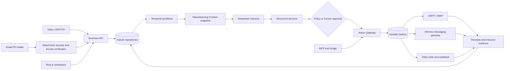

# SupplySentry

English | [简体中文](README.zh-CN.md)

**A stateful AI procurement execution agent for manufacturing teams.**

SupplySentry follows a purchase order after it is issued: it collects supplier commitments, tracks production and dispatch, detects delivery risk, drafts follow-ups, requests human approval for material decisions, and verifies final receipt against ERP or warehouse evidence.

The project is built around five ideas: **business workflow, durable state, controlled tools, human approval, and measurable reliability**.

## The problem

Issuing a purchase order does not finish procurement work. Buyers still spend days or weeks checking email and chat threads, asking for delivery dates, tracking partial shipments, reconciling conflicting answers, and updating ERP records.

This work is difficult to automate safely:

- Suppliers reply in free-form language such as “around next week” or “we can ship 100 units first”.
- Order facts are split across ERP, email, attachments, messaging channels, and warehouse receipts.
- A generated message is not proof that it was sent, and a carrier delivery event is not proof of warehouse receipt.
- Quantity, price, and delivery-date differences can affect production and require a human decision.
- Retrying an uncertain external call can send the same email or write the same ERP change twice.

SupplySentry turns this work into a durable, evidence-backed process instead of treating the LLM as the system of record.

## Business workflow

```text
Approved ERP PO ─┐
                 ├─→ Validate PO and line items
Verified email PO┘
                         ↓
PO Sent → Supplier Commitment → Fulfillment / Production
        → Dispatch / Transit → Delivery / Goods Receipt
                         ↓
             Risk, SLA, notifications, and audit
```

During the lifecycle, the platform continuously runs the following loop:

```text
SLA check
  → detect no response, delay, quantity difference, or missing evidence
  → generate a follow-up draft or recommended action
  → human review when policy requires it
  → persist an Outbox command
  → send through Email / Hermes or write through an ERP connector
  → save the external receipt
  → update the order projection and next SLA
```

An inbound supplier reply follows a separate evidence path:

```text
Receive message
  → identify tenant, supplier, thread, and candidate PO
  → extract delivery, quantity, production, and shipment facts with AI
  → validate against deterministic business schemas
  → request approval for material differences or low-confidence results
  → append evidence and advance the order state
```

## Architecture



| Layer | Responsibility |
| --- | --- |
| Next.js console | Orders, suppliers, risks, SLA, approvals, drafts, configuration, and Chinese/English UI |
| Business and control APIs | Tenant-scoped reads, versioned writes, authorization, and runtime control |
| Temporal runtime | Long-running execution, retries, approval waits, and restart recovery |
| DeepSeek Harness | Supplier-reply analysis and structured recommendations |
| Manufacturing Context | Frozen evidence snapshot supplied to an agent decision |
| Action Gateway | Permission, policy, version, idempotency, and side-effect enforcement |
| Messaging and connectors | Inbox, Outbox, SMTP/IMAP, Odoo, signed webhooks, and delivery receipts |
| Hermes bridge | Dynamic channel catalog, onboarding, inbound spool, and outbound delivery |
| SQLite persistence | Business documents, events, approvals, leases, projections, and audit history |
| MCP bridge | Controlled agent tools mapped to the same business action boundary |

## Key engineering decisions

### The model proposes; the business runtime decides

DeepSeek can extract candidate facts and recommend an action. It cannot directly approve a short delivery, change a PO, mark goods as received, or send a supplier message. Every material action is revalidated against the current order version, user permissions, policy, and connector readiness.

### Free-form replies become evidence before business facts

Supplier messages are associated using trusted thread identifiers, message IDs, supplier identity, and explicit PO references. AI output is checked against typed schemas. Missing values remain unknown, while quantity, price, or delivery-date differences enter human review.

### Long-running work is durable

Procurement execution can last for weeks. Temporal preserves workflow state and approval waits across process restarts. Persisted business facts remain authoritative, so a failed model call or worker restart does not require replaying the entire order.

### External actions are retry-safe

Outbound messages and ERP writes use an Outbox, idempotency keys, leases, optimistic versions, and external receipts. An ambiguous post-dispatch result is held for reconciliation instead of being blindly retried.

### Partial shipment and short delivery are separate decisions

A partial shipment keeps the remaining quantity open. Approving a short delivery permanently closes it. The UI shows the exact remainder and requires an authorized human decision before that effect is committed.

### Messaging transport is separated from procurement policy

Hermes supplies messaging adapters and onboarding for channels such as WeChat, WeCom, WhatsApp, Telegram, DingTalk, and Feishu. SupplySentry owns PO correlation, AI analysis, approvals, state transitions, and audit. A messaging adapter cannot modify procurement state directly.

## Core capabilities

- Five-stage PO execution state machine with line-level evidence.
- ERP synchronization and secure email-attachment PO intake.
- Supplier-reply parsing for delivery dates, quantities, production, and shipment facts.
- SLA-driven follow-up drafts, escalation, notifications, and risk views.
- Human approval for discrepancies, short delivery, and high-impact actions.
- Durable Inbox and Outbox with delivery receipts and uncertain-result handling.
- Odoo, SMTP/IMAP, signed webhook, MCP, and Hermes integration boundaries.
- Supplier, route, risk, document, communication, and audit views.
- Chinese and English interfaces with persisted browser preference.
- Tenant isolation, role-based permissions, encrypted connector credentials, and append-only audit events.

## Project ownership

This project was designed and implemented as an end-to-end engineering project. The work includes:

- Modeling the procurement lifecycle as states, events, approvals, and tools.
- Designing PO, supplier, reply, evidence, SLA, risk, Outbox, and audit contracts.
- Building the Temporal workflow runtime and DeepSeek adapter.
- Implementing Action Gateway controls, idempotency, leases, and optimistic concurrency.
- Integrating Odoo, email, MCP, and Hermes messaging channels.
- Building the full-stack procurement workspace and bilingual interface.
- Writing persistence, permission, recovery, connector, and interaction tests.
- Preparing Docker runtime and deployment contracts.

## Technology stack

`TypeScript` · `Next.js 16` · `React 19` · `Temporal` · `DeepSeek` · `SQLite` · `MCP` · `Hermes Gateway` · `Odoo` · `SMTP/IMAP` · `Docker Compose`

The project uses Temporal and a domain workflow runtime rather than LangGraph. The workflow must survive multi-week waits, process restarts, external acknowledgements, and human approvals while preserving business state outside model context.

## Engineering validation

The latest local validation for the current interface revision includes:

| Check | Result |
| --- | ---: |
| Console tests | 358 / 358 passed |
| Language and business-data preservation tests | 25 / 25 passed |
| Production console build | Passed |
| TypeScript type check | Passed |
| Test files in the monorepo | 192 |
| Procurement lifecycle stages | 5 |
| Supported PO entry paths | 2 |

The tests cover tenant isolation, permissions, optimistic version conflicts, idempotent retries, lease recovery, duplicate inbound messages, uncertain delivery results, human approval, connector failures, persisted browser remounts, and worker restart behavior.

These are engineering reliability results, not model-quality claims. A reproducible supplier-reply evaluation set is the next measurement milestone. Planned metrics include delivery-date extraction accuracy, missing-fact recall, short-delivery recall, PO-association accuracy, human-review acceptance rate, end-to-end task success rate, latency, and token cost.

## Interface languages

The console supports **English and Simplified Chinese**. Use the **中文 / English** switch on the sign-in screen or in the workspace header. The preference is saved in this browser and survives refresh.

- English entry: `http://127.0.0.1:3001/?lang=en`
- Chinese entry: `http://127.0.0.1:3001/?lang=zh-CN`
- Existing order links can add `&lang=en` without losing their order or tab parameters.

UI labels, help, dialogs and dates are localized. Supplier names, material descriptions, original correspondence, attachments, user-entered drafts and audit evidence stay in their original language. Language changes do **not** translate outgoing messages, change tenant time zones, approve orders or trigger business writes. Cloud installations must deploy this source revision to enable these links.

Dictionaries and display-only compatibility logic live in `apps/console/features/localization/`. Run `pnpm test:localization` after changes; `node scripts/extract-ui-messages.mjs` inventories source copy without reading business data or credentials.

## Repository layout

```text
apps/
  console/          Next.js procurement console
  api/              Shared business and control API implementation
  business-api/     Business API entry point
  control-plane-api/ Control API entry point
  temporal-worker/  Durable workflow worker
  mcp-bridge/       MCP bridge for agent tools
  validation/       Shared validation scenarios
  demo*/            Runtime and connector demonstration programs
  mock-model/       Deterministic model endpoint for local validation
packages/
  core/             Business contracts, policies, tasks, and approvals
  agent/            Agent runtime and DeepSeek Harness adapter
  persistence/      SQLite schema, migrations, and repositories
  context/          Manufacturing context and projections
  messaging/        Messaging contracts, persistence, and gateway
  connectors/       ERP and email integrations
  temporal-runtime/ Workflow definitions and client
  supply-chain/     Procurement employee pack and execution nodes
  workflow/         Workflow engine
infra/
  production/       Preview deployment image, topology, and contracts
  temporal/         Local and production Temporal definitions
  hermes/           Hermes bridge and onboarding services
scripts/            Integration checks and deployment packaging
docs/               Scope, architecture, runbooks, and design history
```

## Requirements

- **Node.js 22.18 or later**; Node.js 24 LTS is recommended. Node.js 20 lacks the `node:sqlite` capability used by this project.
- **pnpm 11.7.0**, pinned in `package.json`.
- Docker with Compose when running Temporal or the Hermes stack.
- Separately configured credentials for the external services you intend to use.

## Getting started

```bash
git clone https://github.com/het2333/supply-sentry.git
cd supply-sentry
pnpm install --frozen-lockfile
pnpm typecheck
pnpm test:deploy:contracts
```

Start the APIs and console in separate terminals:

```bash
pnpm api:business     # http://127.0.0.1:4173
pnpm api:control      # http://127.0.0.1:4174
pnpm console         # http://127.0.0.1:3001
```

These commands start the application processes. Authentication, AI processing, durable workflows, and external connections require the corresponding environment configuration.

Configuration templates:

- [Root runtime example](.env.example)
- [Hermes example](infra/hermes/.env.example)
- [Server preview example](infra/production/.env.preview.example)

Provide actual values through your shell or deployment environment. Keep credentials in local configuration or the server secret store.

## Authentication and agent runtime

Demo authentication is disabled by default. Local development can explicitly enable `READYWORK_DEMO_AUTH=1` for the API process; it does not enable anonymous administrator access. Production rejects demo authentication and requires a production identity integration and an independent `READYWORK_SESSION_SECRET`.

The production AI runtime uses DeepSeek Harness. Configure `READYWORK_DSH_REPO` and the provider credentials before starting the Temporal worker. The in-memory adapter is an explicit test option.

```bash
pnpm infra:temporal:up
pnpm temporal:worker
```

See the [Temporal runbook](docs/TEMPORAL-V1-RUNBOOK.md) for setup and operations. ERP writes and outbound messages pass through business action controls and auditable execution records.

## Validation commands

```bash
pnpm typecheck
pnpm --dir apps/console exec tsc --noEmit --incremental false
pnpm test
pnpm test:deploy:contracts
pnpm --filter @readywork/app-console lint
pnpm --filter @readywork/app-console build
```

Runtime demonstrations are available through `pnpm demo`, `pnpm demo:dsh`, `pnpm demo:persist`, and `pnpm demo:mcp`. They validate selected runtime paths and are not evidence of a completed live procurement rollout.

## Current status and next milestones

Implemented product surfaces include the PO workspace, five-stage detail view, supplier directory, risk dashboard, SLA management, notifications, message drafts, connection setup, human approval, bilingual UI, and integration boundaries.

The next portfolio milestones are:

1. Publish a versioned evaluation dataset containing 200–300 anonymized supplier replies.
2. Generate an evaluation report for extraction, correlation, human review, latency, and cost.
3. Record a reproducible end-to-end demo from PO intake to supplier reply and receipt.
4. Add a sanitized public demo deployment and production identity integration.

## Deployment

[infra/production](infra/production) contains the preview Docker image and Compose topology. The [deployment scripts](scripts/deploy) package application code and a separately handled database backup, then verify the payload on the server.

Configure credentials and persistent storage before deployment. Release bundles can contain business data and are excluded from Git. The checked-in preview topology is specific to the existing environment; review the listen addresses and allowed origins for a new server.

The [Hermes integration guide](infra/hermes/README.md) covers the messaging bridge and its configuration.

## Source control and local data

This repository contains source code, tests, dependency lockfiles, deployment scripts, documentation, and required static assets.

The following remain local and are excluded by `.gitignore`:

- Environment secrets, API keys, email authorization codes, and private keys.
- Business databases, database backups, Hermes login state, and runtime sessions.
- Dependencies, compiled output, OCR language caches, logs, and test reports.
- Research checkouts, local agent work files, browser evidence, and release archives.

Back up `data/` and `.readywork/` separately. They contain application state and are not disposable build caches. Cloning this repository does not restore existing orders, user sessions, or service credentials.

Historical documents may refer to local `.research/`, `.superpowers/`, or `artifacts/` paths that are not included in the GitHub repository. The Chinese font used for document rendering and its license are retained under [apps/api/assets/fonts](apps/api/assets/fonts).

## Documentation

- [Product scope and acceptance criteria](docs/PROCUREMENT-V1-SCOPE.md)
- [Platform roadmap](docs/PLATFORM-ROADMAP.md)
- [Architecture](docs/ARCHITECTURE.md)
- [Manufacturing context runbook](docs/MANUFACTURING-CONTEXT-RUNBOOK.md)
- [Temporal runbook](docs/TEMPORAL-V1-RUNBOOK.md)
- [Chinese project guide](README.zh-CN.md)

Detailed engineering documents currently remain in Chinese.

## License and commercial use

Unless you have a separate written commercial agreement with the copyright holder, the SupplySentry source code is licensed under the [GNU Affero General Public License v3.0 only](LICENSE) (`AGPL-3.0-only`). If you modify the software and make it available to users over a network, the AGPL requires you to offer those users the corresponding source code.

Alternative commercial licensing is available for organizations that need to embed, modify, or operate SupplySentry without the AGPL obligations. See [Commercial licensing](LICENSE-COMMERCIAL.md) for the licensing route; no additional rights are granted until a separate agreement is executed.

The SupplySentry name, logo, and brand assets are not licensed under the AGPL. See the [trademark policy](TRADEMARKS.md). Third-party components and bundled fonts remain subject to their respective licenses, including the inventory in [Third-party licenses](docs/THIRD-PARTY-LICENSES.md).
