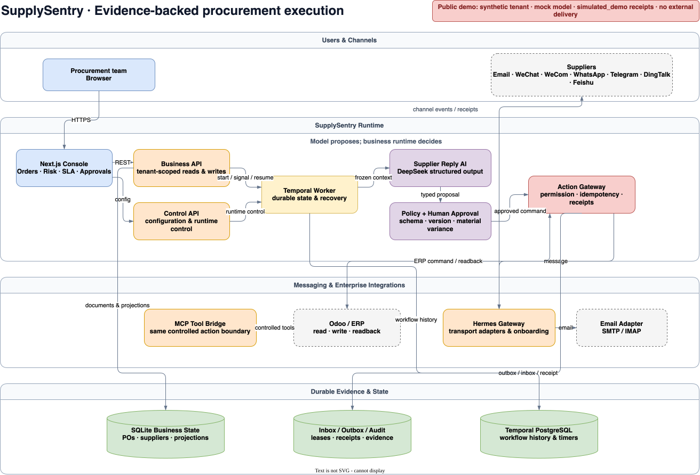

# SupplySentry | Evidence-driven procurement execution agent

English | [简体中文](README.zh-CN.md)

[](https://github.com/het2333/supply-sentry/actions/workflows/ci.yml)
[](LICENSE)
[](#quick-start)


SupplySentry follows a purchase order after issue, turns unstructured supplier replies into traceable evidence, detects delivery risk, requests human approval for material differences, and executes only policy-approved actions through durable, retry-safe gateways.

> **Public portfolio boundary:** every visible record is synthetic. The public stack uses a mock/in-memory model runtime, writes only to tenant `t:public-demo`, and records outbound actions as `simulated_demo` with `externalDelivery=false`.

<picture>
  <source srcset="docs/assets/supplysentry-demo.gif" type="image/gif">
  
</picture>

[**Try Online — publishing after external verification**](#public-demo-status) · [**Run Locally**](#quick-start) · [Evaluation report](reports/evaluations/supplier-replies-v1.md) · [Architecture source](docs/architecture/supplysentry-system.drawio)

| Durable workflow | Controlled side effects | Measured reliability |
| --- | --- | --- |
| Temporal state, waits, retries, approvals, and restart recovery | Permission, policy, version, idempotency, Outbox, and receipt checks | 240 executed contract cases with a committed dataset hash and reproducible runner |

## Product workflow

```text
supplier reply
  → PO / supplier association
  → structured evidence extraction
  → deterministic schema and policy validation
  → human approval when the difference is material
  → controlled message or ERP command
  → durable receipt, projection, SLA, risk, and audit update
```

The platform covers PO intake, supplier commitment, production/fulfillment, dispatch/transit, and delivery/goods receipt. It handles common procurement reality: vague dates, partial shipments, silent quantity shortfalls, conflicting replies, quoted-history contamination, missing evidence, and uncertain external results.

Implemented surfaces include the order workbench, line-level evidence, suppliers, route and risk views, SLA, notifications, drafted messages, approvals, documents, history, configuration, and persisted English/Chinese UI preference.

## Measured evaluation

The published benchmark contains **240 fictional `synthetic_contract_case` records** covering Chinese, English, mixed-language, QQ-style formatting, dates, quantities, partial shipment, price/currency variance, production, transport, quoted history, and ambiguous PO association. These are not customer messages.

The checked-in report is a real execution of `supplysentry-deterministic-v1`, not an estimated score:

| Metric | Executed result |
| --- | ---: |
| Completed cases | **240/240** |
| PO association accuracy | **100.00%** |
| Missing-fact recall | **100.00%** |
| Approval recall | **100.00%** |
| End-to-end accepted-result rate | **100.00%** |
| Fabrication rate | **0.00%** |

Dataset SHA-256: `4452a076d5d0ea7d0de01fee9ea77007976db0d038b718bda2378c455399b331`

The perfect result is a **deterministic contract baseline**: it proves the committed parser and validation rules reproduce their expected outputs on the committed synthetic dataset. It is not a customer-production metric and not a hosted-model generalization claim.

**DeepSeek evaluation: not published.** The optional provider runner exists, but no 240-case DeepSeek report is presented without 240 successful provider calls. Token use and cost remain unavailable for the deterministic runner.

- [Human-readable evaluation](reports/evaluations/supplier-replies-v1.md)
- [Machine-readable results](reports/evaluations/supplier-replies-v1.json)
- [Versioned dataset](evals/supplier-replies/v1/dataset.jsonl)

## Architecture



The model proposes; the business runtime decides. DeepSeek can extract candidate facts and recommend an action, but cannot directly approve a short delivery, mutate a PO, mark receipt, or contact a supplier. Commands cross the Action Gateway only after current-version, permission, policy, and idempotency checks.

| Layer | Responsibility |
| --- | --- |
| Next.js console | Orders, risk, SLA, approvals, drafts, configuration, and bilingual UI |
| Business / control APIs | Tenant-scoped reads, versioned writes, authorization, and runtime control |
| Temporal worker | Durable execution, retries, approval waits, timers, and recovery |
| Supplier Reply AI | Typed proposals from a frozen evidence context |
| Policy + human approval | Schema checks and explicit decisions for material variance |
| Action Gateway | Permission, idempotency, Outbox, receipt, and uncertain-result enforcement |
| Hermes / email / ERP boundaries | Transport adapters and read-write-readback integrations |
| SQLite / Temporal PostgreSQL | Business facts, projections, audit evidence, and workflow history |

Editable source: [Draw.io](docs/architecture/supplysentry-system.drawio) · [Embedded editable PNG](docs/architecture/supplysentry-system.drawio.png) · [Architecture verifier](scripts/docs/verify-architecture.mjs)

## Quick start

Prerequisites: Docker Engine with Compose and approximately 4 GB of available memory.

```bash
git clone https://github.com/het2333/supply-sentry.git
cd supply-sentry
./scripts/demo/demo.sh up --build
```

Open `http://127.0.0.1:3002`, select English or Chinese, and click **Enter public demo**. The command generates local demo-only secrets in an ignored file and starts eight isolated services. No DeepSeek, email, ERP, Hermes, or customer credential is needed.

```bash
./scripts/demo/demo.sh status
./scripts/demo/demo.sh verify
./scripts/demo/demo.sh reset
./scripts/demo/demo.sh down
```

For source development, use Node.js 24.20.0 and pnpm 11.7.0:

```bash
pnpm install --frozen-lockfile
pnpm typecheck
pnpm test
pnpm test:localization
```

## Engineering decisions

- **State is outside the prompt.** Procurement work can last for weeks; Temporal and persisted domain facts survive restarts and approval waits.
- **Free-form replies become evidence before facts.** Trusted thread metadata, supplier identity, explicit PO references, typed output, and validation determine whether a reply can update the projection.
- **Unknown stays unknown.** Missing quantities, dates, or tracking numbers are not invented. Low-confidence or material differences enter review.
- **Side effects are retry-safe.** Outbox commands use idempotency keys, leases, optimistic versions, external receipts, and reconciliation for ambiguous outcomes.
- **Partial shipment is not short-delivery approval.** The former keeps the remainder open; the latter permanently closes it and requires authority.
- **Transport is not business policy.** Hermes, SMTP/IMAP, Odoo, MCP, and signed webhooks terminate at controlled business boundaries.

Technology: `TypeScript` · `Next.js 16` · `React 19` · `Temporal` · `DeepSeek` · `SQLite` · `PostgreSQL` · `MCP` · `Hermes Gateway` · `Odoo` · `SMTP/IMAP` · `Docker Compose`

## Security boundaries

The public demo is intentionally different from production:

- fixed synthetic tenant `t:public-demo` and dedicated Docker volumes;
- only the Console port is published; APIs, Temporal, PostgreSQL, and mock model stay private;
- no production database, `/opt/readywork/shared`, Hermes state, mailbox, ERP, or provider credential is mounted;
- uploads, configuration writes, inbound webhooks, and cross-tenant identifiers fail closed;
- mutations carry a generation token, so a reset rejects stale writes;
- outbound effects are intercepted as `simulated_demo` receipts with `externalDelivery=false`;
- rate limits and periodic reset reduce abuse but do not replace production identity, HTTPS, WAF, backups, or monitoring.

See the [security acceptance report](reports/security/public-demo-security-acceptance.md) and [media acceptance report](reports/demo/media-acceptance.md).

### Public demo status

The IP-based online demo is published in the README only after the exact server deployment passes the same end-to-end verifier used locally. Until then, use the one-command local demo above.

## Repository structure

```text
apps/                 Console, APIs, workers, bridges, demos, and deterministic model
packages/             Domain, workflow, agent, persistence, context, messaging, connectors
infra/demo/           Isolated eight-service public-demo Compose topology
evals/                Versioned synthetic evaluation dataset and schema
reports/              Checked-in evaluation, security, and media evidence
scripts/demo/         Build, start, reset, verify, capture, and server deployment tools
scripts/docs/         Architecture and README contracts
docs/architecture/    Editable Draw.io source and exported presentation assets
.github/workflows/    CI, container smoke test, and GHCR publication
```

## Validation

CI runs frozen installation, type checking, the monorepo test suite, localization tests, deployment contracts, deterministic evaluation reproduction, demo seed checks, the Console production build, and an eight-container smoke test.

Useful release gates:

```bash
pnpm typecheck
pnpm test
pnpm test:localization
pnpm test:deploy:contracts
node --test infra/demo/test/*.test.mjs
pnpm eval:supplier-replies:verify
pnpm eval:supplier-replies:check
READYWORK_PUBLIC_DEMO=1 pnpm --filter @readywork/app-console build
```

## Roadmap

- Publish a separately labeled 240-case hosted DeepSeek evaluation after every provider call succeeds.
- Add production identity, HTTPS, WAF, backups, observability, and incident runbooks for a real deployment.
- Validate production connector readiness per channel and ERP tenant; never infer readiness from the public simulation.
- Expand calibrated human-review and end-to-end business outcome evaluation with authorized, anonymized datasets.

## License

SupplySentry is licensed under [GNU Affero General Public License v3.0 only](LICENSE) (`AGPL-3.0-only`). Network users of a modified deployment must be offered the corresponding source as required by the AGPL.

Organizations that need different obligations may request a separately signed [commercial license](LICENSE-COMMERCIAL.md). The name and brand assets follow the [trademark policy](TRADEMARKS.md); dependencies retain their [third-party licenses](docs/THIRD-PARTY-LICENSES.md).
