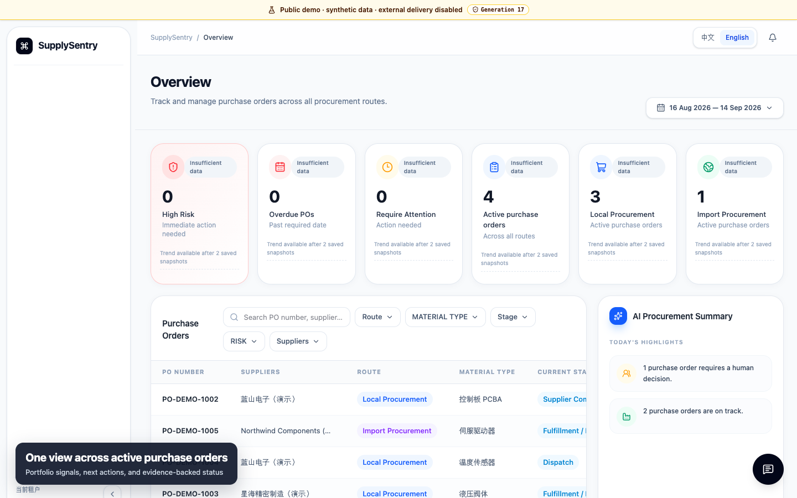
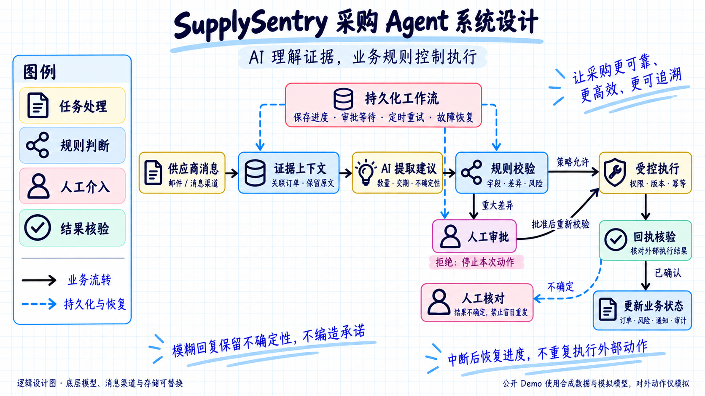
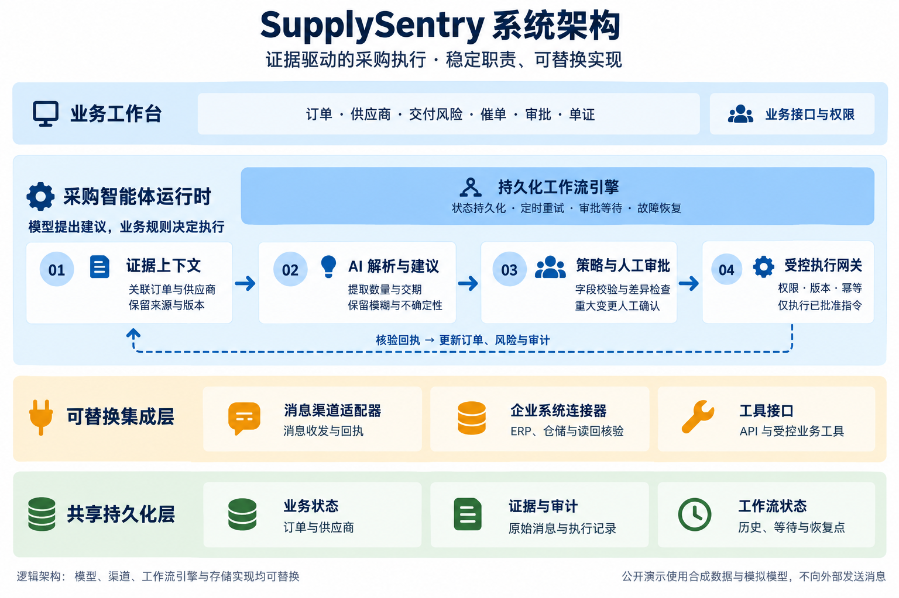

# SupplySentry | 证据驱动的采购执行 Agent

[English](README.md) | 简体中文

[](https://github.com/het2333/supply-sentry/actions/workflows/ci.yml)
[](LICENSE)
[](#快速开始)


SupplySentry 从采购订单发出后开始工作：将供应商的自由文本回复变成可追溯证据，识别交付风险，在重大差异时请求人工审批，并仅通过可审计、可幂等重试的网关执行策略允许的操作。

> **公开作品集边界：**页面中的订单和对话全部为合成数据。公开栈使用 mock/内存模型运行时，仅写入 `t:public-demo` 租户，对外操作记录为 `simulated_demo`，且 `externalDelivery=false`。

<picture>
  <source srcset="docs/assets/supplysentry-demo.gif" type="image/gif">
  
</picture>

[**观看 61 秒完整演示**](https://github.com/het2333/supply-sentry/releases/download/v1.0.0-portfolio/supplysentry-walkthrough-v1.0.0.mp4) · [**在线 Demo 暂停**](#公开演示状态) · [**本地运行**](#快速开始) · [评测报告](reports/evaluations/supplier-replies-v1.md) · [架构图片](docs/architecture/supplysentry-architecture.zh-CN.png)

| 可恢复长流程 | 受控外部操作 | 可量化可靠性 |
| --- | --- | --- |
| Temporal 状态、等待、重试、审批和重启恢复 | 权限、策略、版本、幂等、Outbox 和回执校验 | 240 条已执行合同用例，包含固定数据集哈希和可复现 Runner |

## 业务流程

```text
供应商回复
  → 关联 PO 和供应商
  → 提取结构化证据
  → 确定性 Schema 与策略校验
  → 重大差异进入人工审批
  → 执行受控消息或 ERP 指令
  → 持久化回执、订单投影、SLA、风险与审计
```

平台覆盖 PO 导入、供应商承诺、生产/备货、发运/在途以及交付/收货五个阶段，专门处理采购现实中的模糊交期、部分发货、不告知的数量短缺、前后矛盾的回复、引用历史污染、证据缺失和外部调用结果不确定。

已实现订单工作台、行级证据、供应商目录、路线和风险看板、SLA、通知、消息草稿、审批、文件、历史、配置以及可持久化的中英文界面选择。

## 量化评测

公开基准包含 **240 条虚构的 `synthetic_contract_case` 记录**，覆盖中文、英文、中英混合、QQ 邮件格式、日期、数量、部分发货、价格/币种差异、生产、运输、引用历史和模糊 PO 关联。它们不是客户消息。

以下数字来自 `supplysentry-deterministic-v1` 的真实执行，不是估算：

| 指标 | 实际执行结果 |
| --- | ---: |
| 完成用例 | **240/240** |
| PO 关联准确率 | **100.00%** |
| 缺失事实召回率 | **100.00%** |
| 审批召回率 | **100.00%** |
| 端到端接受率 | **100.00%** |
| 编造率 | **0.00%** |

数据集 SHA-256：`4452a076d5d0ea7d0de01fee9ea77007976db0d038b718bda2378c455399b331`

完美数字仅表示 **deterministic 合同基线**：已提交的解析与校验规则能在已提交的合成数据集上重现预期结果。它不是客户生产指标，也不是托管模型泛化能力的证明。

**DeepSeek evaluation: not published.** 可选 Provider Runner 已实现，但在 240 次 Provider 调用全部成功前，不发布 DeepSeek 报告。deterministic Runner 的 Token 与成本保持为不可用。

- [人类可读评测报告](reports/evaluations/supplier-replies-v1.md)
- [机器可读结果](reports/evaluations/supplier-replies-v1.json)
- [版本化数据集](evals/supplier-replies/v1/dataset.jsonl)

## 系统架构

### Agent 执行流程



从左向右阅读：供应商消息关联订单并保留原文，AI 提取候选事实，业务规则判断能否执行。重大差异先等待人工审批，批准后仍需重新校验权限、版本与幂等条件；拒绝则停止本次动作。外部结果确认后更新业务状态，结果不确定时进入人工核对，不盲目重发。虚线表示持久化恢复支持或异常分支，不表示模型可以绕过业务校验。

这是逻辑执行设计，不是 LangGraph 实现图；当前持久化工作流使用 Temporal。公开 Demo 的外部动作仅模拟，不代表实际供应商已收到消息。

[下载 Agent 系统设计原图](docs/architecture/supplysentry-agent-design.zh-CN.png) · [图片生成说明](docs/architecture/agent-design-generation.md)

### 分层职责



这张 AI 生成的逻辑架构图展示稳定的业务职责，而不是绑定具体厂商的部署单元。更换模型、消息适配器、工作流引擎或存储实现时通常无需重画；当前技术选型见下表。

模型提出建议，业务运行时作出决定。DeepSeek 可以提取候选事实并推荐操作，但不能直接批准短交、修改 PO、确认收货或联系供应商。只有通过当前版本、权限、策略和幂等校验的指令才能跨过 Action Gateway。

| 层级 | 责任 |
| --- | --- |
| Next.js 工作台 | 订单、风险、SLA、审批、草稿、配置和双语界面 |
| 业务/控制 API | 租户隔离读取、版本化写入、授权和运行控制 |
| Temporal Worker | 持久执行、重试、审批等待、定时器和恢复 |
| 供应商回复 AI | 从冻结证据上下文生成类型化建议 |
| 策略与人工审批 | Schema 校验与重大差异的明确决策 |
| Action Gateway | 权限、幂等、Outbox、回执与不确定结果控制 |
| Hermes / 邮件 / ERP 边界 | 传输适配器与读-写-读回集成 |
| SQLite / Temporal PostgreSQL | 业务事实、投影、审计证据和工作流历史 |

架构图片：[中文版 PNG](docs/architecture/supplysentry-architecture.zh-CN.png) · [英文版 PNG](docs/architecture/supplysentry-architecture.en.png)。图片由 AI 直接生成，为位图，不是 Draw.io 可编辑导出文件。

## 快速开始

前置要求：Docker Engine 与 Compose，建议预留约 4 GB 可用内存。

```bash
git clone https://github.com/het2333/supply-sentry.git
cd supply-sentry
./scripts/demo/demo.sh up --build
```

打开 `http://127.0.0.1:3002`，选择中文或 English，点击“进入公开演示”。命令会在已忽略文件中生成仅用于 Demo 的本地密钥，并启动 8 个隔离服务。无需 DeepSeek、邮箱、ERP、Hermes 或客户凭据。

```bash
./scripts/demo/demo.sh status
./scripts/demo/demo.sh verify
./scripts/demo/demo.sh reset
./scripts/demo/demo.sh down
```

源码开发使用 Node.js 24.20.0 和 pnpm 11.7.0：

```bash
pnpm install --frozen-lockfile
pnpm typecheck
pnpm test
pnpm test:localization
```

## 工程决策

- **状态不存在 Prompt 里。**采购执行可以持续数周，Temporal 和持久化领域事实能跨重启与审批等待恢复。
- **自由文本先变成证据，再变成事实。**可信会话元数据、供应商身份、明确 PO 引用、类型化输出和校验共同决定是否能更新订单投影。
- **不知道就保持不知道。**缺失的数量、日期或运单号不会被编造，低置信度或重大差异进入人工审核。
- **外部操作安全重试。**Outbox 指令使用幂等键、租约、乐观版本、外部回执和不确定结果对账。
- **部分发货不等于批准短交。**前者继续保留剩余数量，后者永久关闭剩余数量，必须有权人工确认。
- **传输层不等于采购策略。**Hermes、SMTP/IMAP、Odoo、MCP 和签名 Webhook 都终止在受控业务边界。

技术栈：`TypeScript` · `Next.js 16` · `React 19` · `Temporal` · `DeepSeek` · `SQLite` · `PostgreSQL` · `MCP` · `Hermes Gateway` · `Odoo` · `SMTP/IMAP` · `Docker Compose`

## 安全边界

公开演示与生产环境有意隔离：

- 固定合成租户 `t:public-demo` 和独立 Docker 数据卷；
- 仅暴露 Console 端口，API、Temporal、PostgreSQL 和 mock model 留在私有网络；
- 不挂载生产数据库、`/opt/readywork/shared`、Hermes 状态、邮箱、ERP 或 Provider 凭据；
- 上传、配置写入、入站 Webhook 和跨租户标识都会 fail closed；
- 变更携带 generation token，reset 后的陈旧写入会被拒绝；
- 外发副作用被截获为 `simulated_demo` 回执，且 `externalDelivery=false`；
- 限流和定期重置用于降低滥用，不替代生产身份、HTTPS、WAF、备份和监控。

参见[安全验收报告](reports/security/public-demo-security-acceptance.md)与[媒体验收报告](reports/demo/media-acceptance.md)。

### 公开演示状态

当前不公布任何在线体验地址。此前准备的服务器资源已调整用途，因此目前真实且完整验收过的入口是上面的一键本地 Demo。未来只有当精确 Release 镜像同时通过内部重置模式与无凭据外网模式验收后，才会加入新的托管地址。

## 仓库结构

```text
apps/                 工作台、API、Worker、Bridge、Demo 与确定性模型
packages/             领域、工作流、Agent、持久化、上下文、消息、连接器
infra/demo/           隔离的 8 服务公开 Demo Compose 拓扑
evals/                版本化合成评测数据集与 Schema
reports/              已提交的评测、安全与媒体证据
scripts/demo/         构建、启动、重置、验证、捕获与服务器部署工具
scripts/docs/         架构图与 README 合同
docs/architecture/    可编辑 Draw.io 源文件与展示资源
.github/workflows/    CI、容器烟雾测试与 GHCR 发布
```

## 验证

CI 执行锁定依赖安装、类型检查、Monorepo 测试、本地化测试、部署合同、deterministic 评测重现、Demo 种子校验、Console 生产构建和 8 容器烟雾测试。

常用发布门禁：

```bash
pnpm typecheck
pnpm test
pnpm test:localization
pnpm test:deploy:contracts
node --test infra/demo/test/*.test.mjs
pnpm eval:supplier-replies:verify
pnpm eval:supplier-replies:check
READYWORK_PUBLIC_DEMO=1 pnpm --filter @readywork/app-console build
```

## 路线图

- 在 240 次 Provider 调用全部成功后，单独发布带明确标签的 DeepSeek 评测。
- 为真实部署增加生产身份、HTTPS、WAF、备份、可观测性与故障应急手册。
- 逐渠道、逐 ERP 租户验收生产连接器就绪度，不从公开模拟环境推断生产能力。
- 使用经授权和匿名化的数据集，扩展置信度校准、人工审核与端到端业务结果评测。

## 许可证

SupplySentry 按 [GNU Affero General Public License v3.0 only](LICENSE)（`AGPL-3.0-only`）开源。网络用户使用修改后的部署时，需按 AGPL 要求向这些用户提供对应源代码。

如组织需要不同义务，可申请双方另行签署的[商业授权](LICENSE-COMMERCIAL.md)。名称与品牌素材遵循[商标政策](TRADEMARKS.md)；依赖仍遵循[第三方许可证](docs/THIRD-PARTY-LICENSES.md)。
