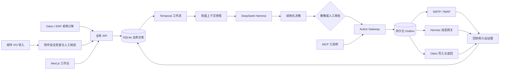

# SupplySentry（交付哨）

[English](README.md) | 简体中文

**面向制造企业采购团队的有状态 AI 采购执行 Agent。**

SupplySentry 从采购订单发出后开始工作：收集供应商承诺、跟踪生产和发运、识别交付风险、生成催办草稿，在关键决策时请求人工审批，并根据 ERP 或仓库证据核验最终收货。

项目围绕五个核心能力构建：**业务闭环、持久状态、受控工具、人工审批和可验证的工程可靠性**。

## 项目背景

采购订单发出并不代表采购工作结束。采购人员仍需在数天或数周内持续查看邮件和聊天记录、追问交期、跟踪部分发货、核对相互矛盾的回复，并更新 ERP。

这些工作很难被安全地自动化：

- 供应商经常回复“大概下周”或“先发 100 件”，没有固定格式。
- 订单事实分散在 ERP、邮箱、附件、消息渠道和仓库收货记录中。
- 生成邮件不等于已经发送，承运商显示送达也不等于仓库已经收货。
- 数量、价格和交期差异会影响生产，需要采购人员作出业务决策。
- 外部调用结果不明确时直接重试，可能造成重复发信或重复写入 ERP。

SupplySentry 将这些工作组织成一条可恢复、有证据、可审核的业务流程，LLM 不作为业务事实的权威来源。

## 核心业务流程

```text
ERP 已批准 PO ─┐
               ├─→ 校验 PO 和行项目
已核验邮件 PO ─┘
                       ↓
PO 发出 → 供应商承诺 → 生产 / 备货
        → 发运 / 在途 → 交付 / 收货
                       ↓
             风险、SLA、通知和审计
```

订单生命周期中持续运行以下闭环：

```text
SLA 检查
  → 识别无回复、延期、数量差异或证据缺失
  → 生成跟进草稿或处理建议
  → 根据策略进入人工审核
  → 写入持久化 Outbox
  → 通过 Email / Hermes 发送，或调用 ERP 连接器
  → 保存真实外部回执
  → 更新订单投影和下一次 SLA
```

供应商回复进入独立的证据链：

```text
接收消息
  → 识别租户、供应商、会话和候选 PO
  → AI 提取交期、数量、生产和发运事实
  → 使用确定性业务 Schema 校验
  → 重大差异或低置信度结果进入人工审批
  → 追加证据并推进订单状态
```

## 系统架构



| 层级 | 负责内容 |
| --- | --- |
| Next.js 工作台 | 订单、供应商、风险、SLA、审批、草稿、配置和中英文界面 |
| 业务与控制 API | 租户隔离读取、版本化写入、权限检查和运行控制 |
| Temporal Runtime | 长流程执行、失败重试、审批等待和重启恢复 |
| DeepSeek Harness | 供应商回复分析和结构化建议 |
| Manufacturing Context | 为一次 Agent 决策冻结可追溯的证据快照 |
| Action Gateway | 检查权限、策略、版本、幂等和外部副作用 |
| 消息与连接器 | Inbox、Outbox、SMTP/IMAP、Odoo、Webhook 和投递回执 |
| Hermes Bridge | 动态渠道目录、扫码接入、入站缓冲和出站投递 |
| SQLite | 业务单据、事件、审批、租约、投影和审计历史 |
| MCP Bridge | 将受控 Agent 工具映射到统一业务操作边界 |

## 关键技术设计

- **模型提出建议，业务运行时作出决定**：DeepSeek 可以提取候选事实并推荐操作，但不能直接批准短交、修改 PO、确认收货或向供应商发消息。每个关键操作都由服务端根据当前订单版本、用户权限、策略和连接器状态重新校验。
- **自由文本先成为证据**：系统根据可信邮件线程、Message-ID、供应商身份和明确 PO 引用关联消息。AI 输出经过类型化 Schema 校验；缺失值保持未知，数量、价格和交期差异进入人工审核。
- **长流程跨重启恢复**：Temporal 保存流程状态和审批等待。模型调用失败或 Worker 重启后可以从持久化业务事实继续执行。
- **外部操作安全重试**：外发消息和 ERP 写入使用 Outbox、幂等键、租约、乐观版本和真实回执。结果不明确时进入人工对账，避免重复执行。
- **区分部分发货与永久短交**：部分发货继续等待剩余数量；批准短交永久关闭剩余数量，并要求有权限的人员确认。
- **消息传输与采购规则分离**：Hermes 提供微信、企业微信、WhatsApp、Telegram、钉钉和飞书等渠道；SupplySentry 负责 PO 关联、AI 分析、审批、状态迁移和审计。

## 核心能力

- 五阶段 PO 执行状态机和行级证据。
- ERP PO 同步和安全的邮件附件 PO 导入。
- 从供应商回复中提取交期、数量、生产和发运事实。
- SLA 驱动的催办草稿、升级、通知和风险看板。
- 对差异、短交和高影响操作进行人工审批。
- 带投递回执和结果不确定处理的持久化 Inbox / Outbox。
- Odoo、SMTP/IMAP、签名 Webhook、MCP 和 Hermes 集成边界。
- 中英文工作台、租户隔离、角色权限和追加式审计。

## 本人负责内容

该项目以端到端个人工程项目方式设计和实现，主要工作包括：

- 将真实采购流程建模为状态、事件、审批和工具。
- 设计 PO、供应商、回复、证据、SLA、风险、Outbox 和审计合同。
- 实现 Temporal 工作流运行时和 DeepSeek 适配器。
- 实现 Action Gateway、幂等、租约和乐观并发控制。
- 接入 Odoo、邮件、MCP 和 Hermes 消息渠道。
- 实现全栈采购工作台和中英文界面。
- 编写持久化、权限、恢复、连接器和交互测试。
- 准备 Docker 运行环境和部署合同。

## 技术栈

`TypeScript` · `Next.js 16` · `React 19` · `Temporal` · `DeepSeek` · `SQLite` · `MCP` · `Hermes Gateway` · `Odoo` · `SMTP/IMAP` · `Docker Compose`

项目采用 Temporal 和领域工作流运行时，没有为了堆砌关键词使用 LangGraph。采购流程需要跨越数周等待、进程重启、外部回执和人工审批，业务状态也必须独立于模型上下文持久化。

## 工程验证结果

| 检查项 | 最近一次结果 |
| --- | ---: |
| Console 测试 | 358 / 358 通过 |
| 语言切换与业务数据保护测试 | 25 / 25 通过 |
| Console 生产构建 | 通过 |
| TypeScript 类型检查 | 通过 |
| Monorepo 测试文件 | 192 个 |
| 采购生命周期阶段 | 5 个 |
| PO 合法入口 | 2 类 |

测试覆盖租户隔离、权限、乐观版本冲突、幂等重试、租约恢复、重复入站消息、投递结果不确定、人工审批、连接器故障、浏览器重新挂载和 Worker 重启。

以上属于工程可靠性结果，不是模型准确率。下一项测量里程碑是建立可复现的供应商回复 Evaluation 数据集，评测交期抽取准确率、缺失事实 Recall、短交识别 Recall、PO 关联准确率、人工审核接受率、端到端成功率、延迟和 Token 成本。

## 中英文界面

登录页和工作区页头支持 **中文 / English** 切换，刷新后保留选择。

- 英文入口：`http://127.0.0.1:3001/?lang=en`
- 中文入口：`http://127.0.0.1:3001/?lang=zh-CN`
- 现有订单链接可追加 `&lang=en`，不丢失订单或页签参数。

切换只影响界面、提示、弹窗及日期显示；供应商名称、物料描述、原始消息、文件、未发送草稿和业务证据保留原文。不会修改企业时区、审批订单或发送消息。云端需部署本次源码版本后才能使用。修改界面文案后运行 `pnpm test:localization` 检查回归。

GitHub 项目名称为 SupplySentry；现有工程目录、`@readywork/*` 包、`READYWORK_*` 配置和部署服务仍使用早期 Readywork 标识。采购产品范围与验收标准见 [采购执行 V1 契约](docs/PROCUREMENT-V1-SCOPE.md)。

## 仓库结构

```
docs/                       架构蓝图（先读 ARCHITECTURE.md）
packages/
  core/                     ① Business Runtime 微内核（事件/组织/员工Spec/审批/Policy/预算/调度/Task状态机/Worker/端口/仓储）
  agent/                    ④ Agent Runtime（默认 DeepSeek Harness + 显式 InMemory 测试桩）
  workflow/                 ④ 流程层引擎（agent/tool/skill/wait/approval/condition/notify/end）
  skills/                   ⑤ 能力层插件系统（SkillRegistry）
  tools/                    ⑥ 工具层插件系统（ToolRegistry + 内存参考工具：ERP/Email/PDF/Excel）
  context/                  ⑤ Enterprise Context Graph（内存实现）
  control-tower/            ⑨ Control Plane 控制塔查询（KPI/状态/审批）
  persistence/              node:sqlite 持久化（仓储实现 + 崩溃恢复）
  evals/                    Evaluations（轨迹录制/评分/回归对比）
  supply-chain/             第一个真实 Employee Pack（Navisight 采购执行员工）
apps/
  demo/                     验证链演示（InMemory 桩）
  demo-dsh/                 DeepSeek Harness Adapter 验证链（无 key 自动起 mock 模型）
  demo-persist/             持久化与崩溃恢复演示
  demo-mcp/                 MCP 工具桥演示（agent 原生 tool-calling）
  validation/               共享验证链（demo 与 demo-dsh 复用，业务层零改动）
  mock-model/               OpenAI 兼容 mock 模型端点（脚本化决策 / 原生 tool-calling，SSE 流式）
  mcp-bridge/               MCP 工具桥（stdio shim + 主进程执行器 + cordis.mcp.yml）
  evals/                    Evaluations 回放评测脚本
  web/                      Web Control Tower 仪表盘（node:http 零依赖）
  console/                  Next.js + Tailwind「员工优先」控制台（员工详情/Workers/Workflows/Skills/Tools/Policies/审批）
  api/                      最小 HTTP API（node:http，零依赖）
```

## 快速开始

需要 Node.js **22.18 及以上版本**（推荐 Node.js 24 LTS）和 **pnpm 11.7.0**；Node.js 20 不支持本项目使用的 `node:sqlite`。

```bash
pnpm install --frozen-lockfile
pnpm typecheck     # 全仓类型检查
pnpm test          # 状态机 / Policy / Workflow / Adapter / 持久化 / MCP 桥 测试
pnpm demo          # 平台运行时演示链（InMemory 桩；不作为采购产品 V1 验收）
pnpm demo:dsh      # 真实 DeepSeek Harness runtime 重跑验证链（无 key 自动起 mock 模型）
pnpm demo:persist  # node:sqlite 持久化与崩溃恢复演示
pnpm demo:mcp      # MCP 工具桥：DSH agent 原生 tool-calling 调用我们的工具
pnpm eval          # Evaluations 回放评测（正常交付 vs 延期交付回归对比）
pnpm api:business  # 业务面 API → http://127.0.0.1:4173
pnpm api:control   # 控制面 API → http://127.0.0.1:4174
pnpm temporal:worker # Temporal Worker；AI 节点默认调用 DeepSeek Harness
pnpm console       # Next.js 业务/开发者控制台 → http://127.0.0.1:3001
pnpm web           # 零依赖 Control Tower 仪表盘（备用）→ http://127.0.0.1:4180
```

## 源码与本地运行数据

版本库包含源码、测试、依赖锁文件、部署脚本、文档及必要静态资源。真实环境配置、API 密钥、邮箱授权码、业务数据库、Hermes 登录状态、运行日志、依赖目录、构建缓存和历史部署包均由 `.gitignore` 排除，克隆仓库不会获得现有环境的订单或登录凭据。

环境配置模板保留在 `.env.example`、`infra/hermes/.env.example` 和 `infra/production/.env.preview.example`，按所选运行方式在本机或服务器单独配置实际值。`data/`、`.readywork/` 中的业务数据和凭据需要另行备份；它们不属于可随意删除的缓存。`.research/`、`.superpowers/`、`artifacts/` 是本地研究与历史验收材料，文档中的对应路径不会随 GitHub 源码一起上传。

## 本地认证与监听

控制台和 API 的演示认证默认关闭；控制台默认只监听 `127.0.0.1`。如需本机启动验收，可只对当前 API 命令临时设置 `READYWORK_DEMO_AUTH=1`，然后从 Web 登录页建立 HttpOnly 会话。该开关只启用本地验收账户，不再隐式授予匿名管理员；高风险兼容开关 `READYWORK_ENABLE_LOCAL_ANONYMOUS_AUTH=1` 必须另行显式设置，正常验收不应使用。不要将这些变量写入部署环境、`.env` 或版本库文件，也不要在文档或配置中保存演示密码、会话密钥或真实凭据。无论变量为何值，`NODE_ENV=production` 都会拒绝演示认证；生产环境应配置独立的强 `READYWORK_SESSION_SECRET` 并接入正式身份提供方。

## 平台运行时演示链（非采购产品 V1 验收）

`pnpm demo` 依次演示：

**创建员工 → 给权限 → 给业务任务 → AI执行 → 等待 → 恢复 → 调工具 → 人工审批 → 完成 → 评测**

覆盖三张员工卡：采购需求员工（大额审批）、询价员工（报价收集→比价→中标审批）、PO 供应商运营员工（交期确认→延期检测→催交→到货关闭）。

这条 demo 链只验证通用运行时编排。采购产品 V1 是否完成，只能按 [采购执行 V1 范围与验收契约](docs/PROCUREMENT-V1-SCOPE.md) 中的真实 API、SQLite、连接器回执、权限、审计和十项上线验收判断。

## 技术要点

- TypeScript + pnpm monorepo；业务 API 主要使用 Node 原生能力，控制台使用 Next.js，可靠编排使用 Temporal
- 当前生产 AI Runtime 默认使用 **DeepSeek Harness**；`InMemoryAgentAdapter` 仅供显式测试与确定性回归
- `HarnessRuntime` 使用 JSON-RPC stdio（与官方 SDK 同一
  wire 契约）+ `DeepSeekHarnessAdapter`；`pnpm demo:dsh` 以真实 DSH runtime 子进程重跑验证链，
  无 key 时自动使用 `apps/mock-model`（OpenAI 兼容端点），有 `DEEPSEEK_API_KEY` 即直连真实模型
- P2 Temporal 图运行中的 AI 节点通过 `AgentRuntimePort` 进入 Harness；所有 ERP、邮箱等副作用仍统一经过 Action Gateway
- 采购执行链已提供版本化 PO/发票/行级三单、审批绑定续跑和持久化 Outbox；只有外部连接器明确成功，PO 发送或 ERP 应付回写才推进为已派发/已回写，超时结果转人工对账而不重复发送
- 控制面生产就绪度聚合 Temporal worker/poller、Action/Outbox 租约、失败队列、连接器/凭据与安全告警；未配置或未观测到真实服务时明确显示未就绪
- Teams 协同使用租户 + AAD 身份绑定、Bot Framework JWT/JWKS 校验和 OAuth 主动通知；Bot、身份绑定、会话或凭据缺失时返回 unavailable，绝不假报已发送
- 默认 Harness composition 为 decision-only：不加载 Bash、文件系统、MCP、ERP 或邮件工具；子进程按员工隔离，且只继承最小环境变量白名单
- 一切业务状态通过领域事件驱动：`Task` 状态机 + `Wait/Resume/Retry/Approval` + 事件恢复

启动 Temporal Worker 前必须显式设置 `READYWORK_DSH_REPO` 和远端模型的 `DEEPSEEK_API_KEY`。只有本地确定性回归才使用 `READYWORK_AGENT_RUNTIME=inmemory`；缺少 DSH 配置会直接失败，不会静默降级。

## 当前状态与下一步

已经实现的产品界面包括 PO 工作台、五阶段详情、供应商目录、风险看板、SLA、通知、消息草稿、连接配置、人工审批和中英文界面。

下一阶段作品集目标：

1. 发布包含 200～300 条脱敏供应商回复的版本化评测集。
2. 生成抽取、关联、人工审核、延迟和成本 Evaluation Report。
3. 录制从 PO 导入、供应商回复到最终收货的可复现演示视频。
4. 提供脱敏公开体验环境并接入生产身份认证。

详见 [docs/ARCHITECTURE.md](docs/ARCHITECTURE.md)。

## 开源许可证与商业授权

除非你已与版权所有者签署独立书面商业协议，SupplySentry 源代码均依据 [GNU Affero General Public License v3.0 only](LICENSE)（`AGPL-3.0-only`）授权。若修改本软件并通过网络向用户提供服务，AGPL 要求向这些用户提供对应源代码。

需要在不承担 AGPL 开源义务的情况下嵌入、修改或运营 SupplySentry 的组织，可以申请独立商业授权。申请方式见[商业授权说明](LICENSE-COMMERCIAL.md)；双方签署独立协议前，该说明本身不授予任何额外权利。

SupplySentry 名称、Logo 和品牌素材不属于 AGPL 授权范围，详见[商标政策](TRADEMARKS.md)。第三方组件和内置字体继续遵循各自许可证，具体记录见[第三方许可证清单](docs/THIRD-PARTY-LICENSES.md)。
